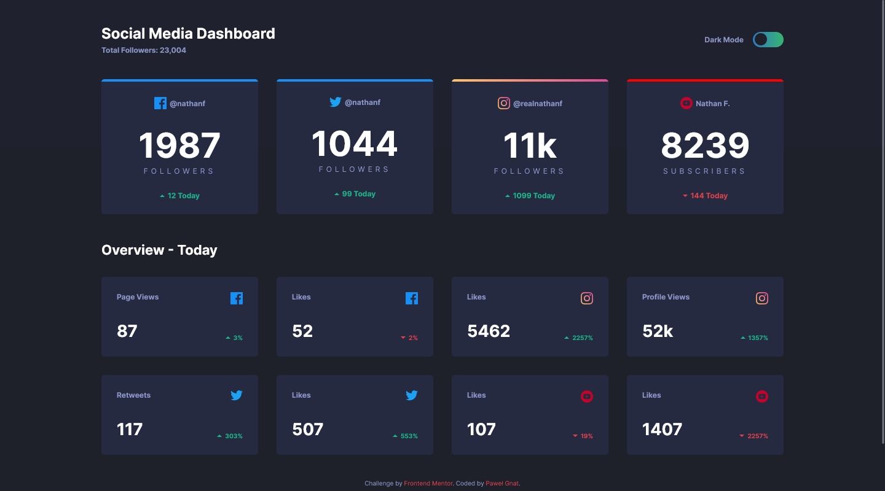

# Frontend Mentor - Social media dashboard with theme switcher solution

This is a solution to the [Social media dashboard with theme switcher challenge on Frontend Mentor](https://www.frontendmentor.io/challenges/social-media-dashboard-with-theme-switcher-6oY8ozp_H). Frontend Mentor challenges help you improve your coding skills by building realistic projects.

## Table of contents

- [Overview](#overview)
  - [Screenshot](#screenshot)
  - [Links](#links)
- [My process](#my-process)
  - [Built with](#built-with)
  - [What I learned](#what-i-learned)
- [Author](#author)

## Overview

### Screenshot

### Links

- Live Site URL: [Social media dashboard with theme switcher](https://pawel-gnat.github.io/Frontend-Mentor-Social-media-dashboard/)

## My process

Java Script:

1. Created variables,
2. Made 3 loop functions with array variables to toggle classlist 'white',
3. Made event listener on theme switcher to toggle white class with the rest of variables.

### Built with

- Semantic HTML5 markup
- CSS custom properties
- Flexbox
- Mobile-first workflow
- JavaScript

### What I learned

Challenge completed within 13,5 hours. I learned how to toggle theme mode and I made a nice looking flexbox sections. I like how they response to bigger width.

## Author

- Frontend Mentor - [@Pawel-Gnat](https://www.frontendmentor.io/profile/Pawel-Gnat)
